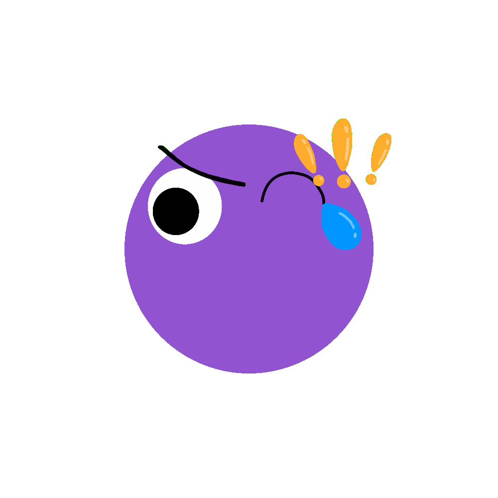

# Face Emoji Generator
## Project Description
For this project, I made a Face Emoji Generator using Python. It is a program that can generate different face emojis every time you run the program. You can customize the width and height of the canvas to get an emoji of a size that matches your desire. It also has the option to allow users to choose whether or not to have a background color in the image, which grants a wider usage of the emoji generated by this program. Almost everything in the image generated by the program is randomly selected. This includes the background color, the face color, the facial elements, and even the presence of the mouth. This shows that artistic skills are not required to create a new emoji. \
Since the emojis are generated completely randomly, we oftentimes will get a face that looks goofy, hilarious, or weird with unmatching face elements that are pieced together. This makes it harder for us to interpret the feeling conveyed by the emoji. Considering that we are used to an internet space where all emojis are carefully designed and assigned a fixed meaning, this project challenges this norm by showing that emojis can contain multiple emotions at the same time. This leads us to ponder: is this version of the emoji a better option for us in terms of the blooming information we get every day and the fast pace of life we have? 

## Preparation before running
### Install pygame
Run this line in terminal
```
python3 -m pip install -U pygame --user
```
Check this page if you meet any issues with installation: https://www.pygame.org/wiki/GettingStarted \
Check pygame documentation for more information: https://www.pygame.org/docs/

### Install Pillow (PIL) (If you want to use the function of removing background colors)
Run this line in terminal
```
pip install Pillow
```

## Example Outputs
Emojis **with** background colors: \
 \
 \
Emojis **without** background colors: \
 \
